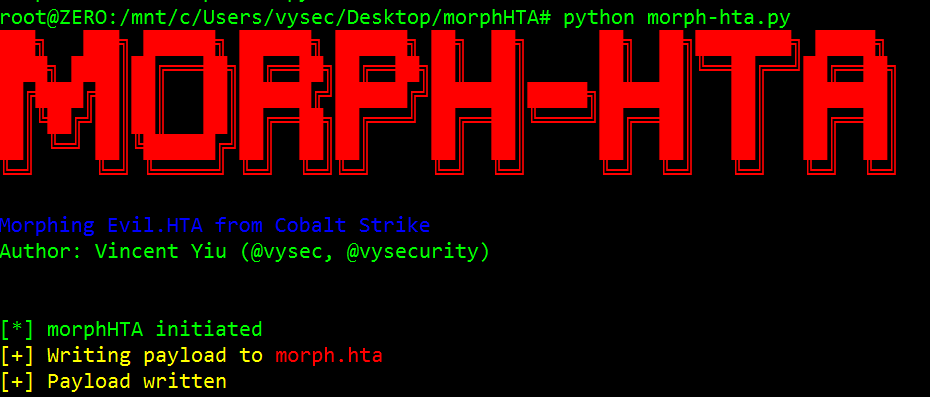
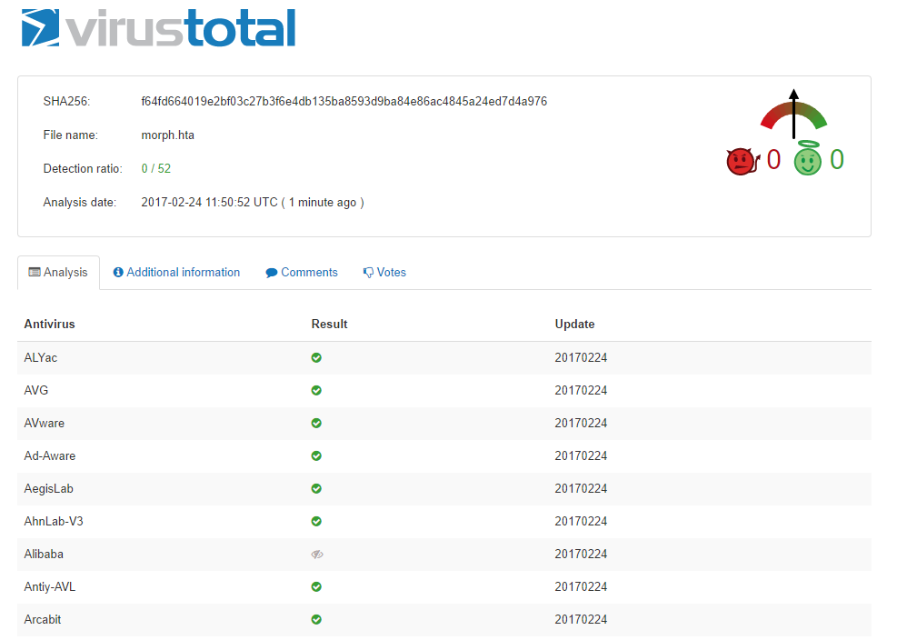

Disclaimer
==========
As usual, this code and tool should not be used for malicious purposes.

Written by Vincent Yiu of MDSec Consulting's ActiveBreach team. Modification of code is allowed with credits to author.

Explorer and SWBemLocator COM Moniker research is by @enigma0x3

morphHTA
========



<b>Usage</b>: 
```
usage: morph-hta.py [-h] [--in <input_file>] [--out <output_file>]
                    [--maxstrlen <default: 1000>] [--maxvarlen <default: 40>]
                    [--maxnumsplit <default: 10>]

optional arguments:
  -h, --help            show this help message and exit
  --in <input_file>     File to input Cobalt Strike PowerShell HTA
  --out <output_file>   File to output the morphed HTA to
  --maxstrlen <default: 1000>
                        Max length of randomly generated strings
  --maxvarlen <default: 40>
                        Max length of randomly generated variable names
  --maxnumsplit <default: 10>
                        Max number of times values should be split in chr
                        obfuscation
```


Examples:
=========
```
/morphHTA# python morph-hta.py
███╗   ███╗ ██████╗ ██████╗ ██████╗ ██╗  ██╗      ██╗  ██╗████████╗ █████╗
████╗ ████║██╔═══██╗██╔══██╗██╔══██╗██║  ██║      ██║  ██║╚══██╔══╝██╔══██╗
██╔████╔██║██║   ██║██████╔╝██████╔╝███████║█████╗███████║   ██║   ███████║
██║╚██╔╝██║██║   ██║██╔══██╗██╔═══╝ ██╔══██║╚════╝██╔══██║   ██║   ██╔══██║
██║ ╚═╝ ██║╚██████╔╝██║  ██║██║     ██║  ██║      ██║  ██║   ██║   ██║  ██║
╚═╝     ╚═╝ ╚═════╝ ╚═╝  ╚═╝╚═╝     ╚═╝  ╚═╝      ╚═╝  ╚═╝   ╚═╝   ╚═╝  ╚═╝

Morphing Evil.HTA from Cobalt Strike
Author: Vincent Yiu (@vysec, @vysecurity)


[*] morphHTA initiated
[+] Writing payload to morph.hta
[+] Payload written
```


<b>Max variable name length and randomly generated string length reduced to reduce overall size of HTA output:</b>

`/morphHTA# python morph-hta.py --maxstrlen 4 --maxvarlen 4`


<b>Max split in chr() obfuscation, this reduces the number of additions we do to reduce length:</b>

`/morphHTA# python morph-hta.py --maxnumsplit 4`


<b>Change input file and output files:</b>

`/morphHTA# python morph-hta.py --in advert.hta --out advert-morph.hta`


Video how to
============
https://www.youtube.com/watch?v=X4S2aQ4o_jA


VirusTotal Example 
==================

<b><i>I suggest not uploading to VT</i></b>:




Example of Obfuscated HTA content
=================================

